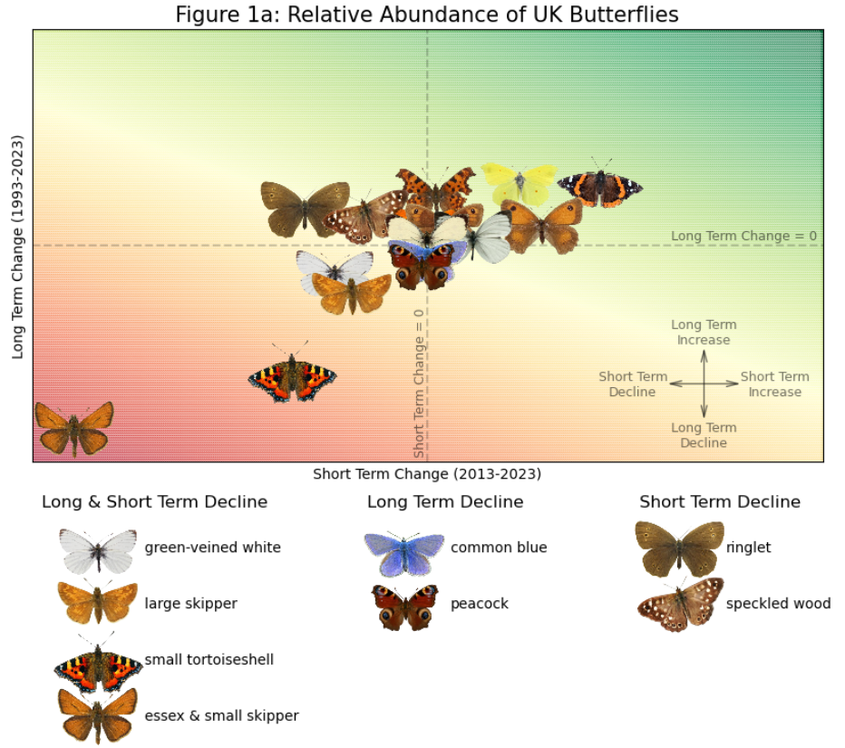

<h1 align='center'>Modelling the Abundance of UK Butterflies</h1>

## 1. Project Background
### Context
As part of a new government-led green initiative to prevent biodiversity loss, regional councils are to receive a ‘nature grant’ that will be allocated for habitat restoration and species protection. This comes after a report in the State of Nature revealed the number of endangered species in Great Britain had risen to 16% [1]. Many experts believe this is the result of environmental pressures such as, climate change, air pollution, agricultural pollution and invasive species [2].
### The Goal
It is well known that butterflies are excellent indicators of terrestrial biodiversity, due to the diverse range of habitats they occupy, and their sensitivity to environmental changes. To help regional councils decide how they should allocate their grant, the UK Data for Wildlife Conservation (UKDWC) has been commissioned to produce a report detailing the abundance trends of butterflies on a national scale. The report will highlight species of butterfly in decline and produce a list of ‘recommended actions’ that regional decision makers can use to focus their budgets accordingly. 
### About the UKDWC
The UKDWC is a non-profit environmental research organisation, that monitors biodiversity and ecosystems in the UK, reporting its findings to various charities and central government. Since its founding in 1963, the company has gained a reputation for its excellent ecological modelling capabilities and data-centric environmental reports. 

<image src='images/project_background/logo.png' width=300>

## 2. Data Sourcing & Project Data
Data for the project was acquired by accessing the UKBMS (UK Butterfly Monitoring Scheme) ecological survey data, made available by the UKCEH (UK Centre for Ecology and Hydrology). Two datasets were used: ‘site indices 2023’, and ‘site location data 2023’ [3]. Before the analysis, both datasets were cleaned and joined (see table 2a) in Python to form the master dataset used throughout the project. 

<image src='images/project_background/data_structure.png' width=500>

###### *Table 2a: Shows the schema from 'site indices 2023' and 'site location data 2023'. Each survey site was identifiable through a unique key ('SITE_CODE' or 'Site_Number') which was used to merge the datasets. Code used to clean the original datasets is available here: ukbms_site_location_cleaning, ukbms_site_indices_cleaning, join_indices_location.*

## 3. Executive Summary
In this project, UKBMS survey data is used to model the relative abundance (RA) of UK butterflies over the last 30 years. For an overview of the methodology, click here. 
  
Of the 17 species analysed, nearly a third are found to be in long term decline, with 24% showing both short- and long-term decline. The Essex Skipper and Small Skipper have been identified as ‘high risk’, with population levels falling by 90% since 1993. Another struggler, the Small Tortoiseshell has declined at an average rate of 5%/yr since 1993 and is forecast to become ‘high risk’ in 2037 if long term trends continue. Possible causes are found to be agricultural pollution, climate change and the influence of invasive species [2]. The remainder of this report will highlight key metrics in the worst performing species, the implications and possible solutions. In the following section, an overview of long and short term change in relative abundance (RA) is provided. Species-specific insights are found in section 5. Section 6 suggests likely outcomes if current trends continue. Finally, in section 7, the recommended actions for regional policy makers are detailed. Figure 3a below, summarises the the results of the report, showing both long and short term changes in RA for butterflies that were analysed.

<h3 align='left'>Figure 3a: Relative Abundance of UK Butterflies</h3>

###### *Figure 3a: Species with increasing long term RA are located above the 'Long Term Change = 0' line. Species with increasing short term RA are located to the right of the 'Short Term Change = 0' line. Species with decreasing RA are highlighted below the plot. To see how the plot was produced, click here.*

## 4. General Insights
<h3 align='left'>Figure 4a: Long Term Changes</h3>

<image src='images/general_insights/long_term.png' width=1200>

###### *Figure 4a: In the plot titled 'All Habitats', all species are shown. The remaining three plots, only show species native to that habitat [4],[5],[6]. Note that in 'hedgerow and field margin' and 'damp grassland and meadow' habitats, the Essex Skipper is not considered. In the remaining plots, both the Essex and Small Skipper are considered. To see why some long term RA changes are not significant, click here.*
  

Figure 4a shows the percentage change in species relative abundance since 1993. Excluding non-significant results, RA in 41% of the species analysed decreased, with the Essex and small Skipper declining by the greatest magnitude (90%), followed by the Small Tortoiseshell (79%). The proportion of species which increased and decreased was reasonably balanced when grouped by habitat: 
- 45% of species native to ‘**hedgerow and field margin**’ habitats declined, while 36% exhibited long term gains.
- 56% of butterfly species typically found on ‘**road verges**’ declined. Long term gains were observed in the remaining species.
- 3 out of 5 ‘**damp grassland and meadow**’ species declined with the remainder increasing.

<h3 align='left'>Figure 4b: Short Term Changes</h3>

<image src='images/general_insights/short_term.png' width=1200>

###### *Figure 4b: In the plot titled 'All Habitats', all species are shown. The remaining three plots, only show species native to that habitat [4],[5],[6]. Note that in 'hedgerow and field margin' and 'damp grassland and meadow' habitats, the Essex Skipper is not considered. In the remaining plots, both the Essex and Small Skipper are considered. To see why some short term RA changes are not significant, click here.*
 

Figure 4b shows the percentage change in species relative abundance since 2013. Less than a third of all butterflies increased in the short term; the remainder either declined or showed no significant change. The worst performing butterflies were the Small/Essex Skipper (-81%) and the Small Tortoiseshell (-47%). The Ringlet and Speckled Wood, species that both exhibited long term gains (see figure 4a), declined by 43% and 25% respectively. When grouped by habitat, the proportion of species with increasing or decreasing RA was mixed:
- For species prevalent in '**hedgerow and field margin habitats**', 42% declined, while 25% increased. 
- Relative abundance in 44% of butterflies common to '**road verges**' decreased while an increase was observed in a third of these species.  
- 60% of species associated with '**damp grassland and meadows**' declined, with no increases documented. 

## 5. Species Specific Insights
### Figure 5a: Essex & Small Skipper

<image src='images/species_insights/relative_abundance_es_skipper.png' width=600>

###### *Figure 5a: Annual abundance was computed by taking a geometric mean of all RA indices for a species in a particular year. RA was computed by dividing the index from any survey year by the baseline index. The smoothed trend was compiled by extracting median annual predictions from the 'bootstrapped' stage 2 GAM model. For more information about the GAM models used in this report, click here.*
 
Figure 5a shows RA trends for the Essex and Small Skipper since 1993. In 2023, RA reached its highest recorded level since 2016, although long-term trends continued to fall. Two periods of decline were observed: between 1997 and 2004 RA fell by 8%/yr on average. Then from 2015, following a period of stability, RA declined at an average rate of 18%/yr. 
  
The first period of decline can be linked to the introduction of neonicotinoids, first used in UK agriculture in 1993 [7]. The Essex and Small Skipper are particularly susceptible to these chemicals, since their primary food sources, Yorkshire Fog and Cocks Foot, grow on field boundaries [8]. It is difficult to explain the brief period of stability between 2006 and 2015, but continued use of neonicotinoids on winter crops, and sugar beet in 2022, despite a partial ‘ban’, have likely contributed to the continuing decline [9].  

### Figure 5b: Small Tortoiseshell

<image src='images/species_insights/relative_abundance_s_tortoiseshell.png' width=600>

###### *Figure 5b: Annual abundance was computed by taking a geometric mean of all RA indices for a species in a particular year. RA was computed by dividing the index from any survey year by the baseline index. The smoothed trend was compiled by extracting median annual predictions from the 'bootstrapped' stage 2 GAM model. For more information about the GAM models used in this report, click here.*
 
RA trends from 1993, are illustrated for the Small Tortoiseshell in figure 5b. Decline in RA occurred over two periods: between 1996 and 2002 (-63%), and then again between 2017 and 2023 (-28%). The rate of decline during the latest period was slightly lower at 5%/yr compared to 9%/yr in the 6 years pre-2002. 
  
The initial decline corresponds with the settling of invasive species Sturmia Bella from continental Europe in the 1990s [10]. Sturmia Bella threaten Small Tortoiseshells, because both species occupy the common nettle at the beginning of their lifecycle. Sturmia Bella eggs, hatch after being consumed by Small Tortoiseshell caterpillars, killing the host [10]. Reduced rates of decline suggest possible adaptation. Instances of early hibernation in the species has been noted [11], and a change in seasonality could affect brooding patterns, thereby reducing interactions with Sturmia Bella larvae. However, it is more likely, anomalous seasonal cycles have been triggered by warmer Springs [12], an effect of climate change. 

### Figure 5c: Green-veined White

<image src='images/species_insights/relative_abundance_gv_white.png' width=600>

###### *Figure 5c: Annual abundance was computed by taking a geometric mean of all RA indices for a species in a particular year. RA was computed by dividing the index from any survey year by the baseline index. The smoothed trend was compiled by extracting median annual predictions from the 'bootstrapped' stage 2 GAM model. For more information about the GAM models used in this report, click here.*
 
RA between 1993 and 2023 is shown for the Green-veined white in figure 5c. Over the study period, RA declined by 34% from its 1993 baseline, although it did increase steadily between 1993 and 2009 (+0.7%/yr). After this period, RA fell by 37% in total, and the rate of decline increased every year to more than 7%/yr in 2023.
    
Decline of this species coincides with a period of increased National drought frequency (2004-2006, 2010-2012, 2016-2019 & 2022-2023) [13]. This is likely to have impacted access to its main food sources (garlic mustard and watercress) which thrive in lush grassland areas [14].  

### Figure 5d: Large Skipper

<image src='images/species_insights/relative_abundance_l_skipper.png' width=600>

###### *Figure 5d: Annual abundance was computed by taking a geometric mean of all RA indices for a species in a particular year. RA was computed by dividing the index from any survey year by the baseline index. The smoothed trend was compiled by extracting median annual predictions from the 'bootstrapped' stage 2 GAM model. For more information about the GAM models used in this report, click here.*
 
Figure 5d details RA trends for the Large Skipper between 1993 and 2023. Long term trends resembled those observed in the other ‘grass skippers’ (the Essex and Small Skipper) with two distinct periods of decline: 1993 to 2006 (-34%), and 2016 onwards (-31%). A small ‘rebound’ was observed in between these periods (+13%) but over the study length RA saw a net decrease of 48%. An accelerated rate of decline was observed after 2019, with record rates recorded in successive years (-4% in 2020, -7% in 2021, -8% in 2022 and -10% 2023). 
   
All three Skippers share common food sources, but unlike its relatives, Large Skipper caterpillars also feed on Purple Moor-grass [15], which is typically not found in agricultural settings [16]. Hence, the Large Skipper, remains exposed to neonicotinoids but to a lesser extent. This could explain why population levels have declined, but not to the same magnitude seen in the Small and Essex Skipper. Recent accelerated declines mirror those seen in other ‘grass skippers’ (see Figure 5a for the Essex and Small Skipper trends).  

## 6. Looking to the Future
### Two species are already threatened, and more could follow...

### Figure 6a: Species Risk Timeline 

<image src='images/species_insights/species_timeline.png' width=800>

###### *Figure 6a: A species is 'high risk' when the 'smoothed trend' for RA falls below 10% of its baseline (1993) level. Similarly, a species becomes 'moderate risk' when RA drops below 25% of its baseline. Here, the average rate of decline since 1993 is used to estimate when a species will meet these thresholds. Thresholds are indicated by a colour coded 'X'.*
 

- The Small and Essex Skipper are now classified as 'high risk', meaning population levels have decreased by at least 90% since the 1993 baseline survey.
- Long term decline of the Small Tortoiseshell increased to 79% in 2023, meaning it is considered 'moderate risk'. If long term trends continue, it will become high risk by 2037.
- The Large Skipper is forecast to become 'moderate risk' within the next 30 years. 

## 7. Recommendations
### Blanket ban on neonicotinoids pivotal for the Skipper revival…
Despite reduced use in the UK since 2018, neonicotinoids continue to contaminate key food sources such as Yorkshire Fog and Cocksfoot due to their application on winter crops and estimated half-life of three years. To prevent further use, farmers should be incentivised with subsidies to use less harmful alternatives such as chlorantraniliprole, which has been shown to produce effective corn yields. 
- In 2023, the Essex and Small Skipper were officially declared ‘high risk’.
- Following the introduction of neonicotinoids in 1993, Essex and Small Skipper population levels have declined by 90%.
- Large Skipper RA is down 48% on 1993 levels. 

### Small Tortoiseshells to benefit from invasive species monitoring…
Invasive species Sturmia Bella have been associated with the decline of Small Tortoiseshells, although it is likely the decrease is multifactorial. Detailed abundance and occupancy surveys will be important for quantifying their impact. 
- Small Tortoiseshell butterflies have declined at a rate of more than 5%/yr since 1993.
- In 2023, the annual RA of Small Tortoiseshell butterflies dropped to levels not seen since 2008.

### Water retention in lush grassland habitats is key for the Green-veined White…
Planting trees and hedges in field boundaries is estimated to increase water infiltration up to 60 times and can be an effective flood prevention strategy for farmers in the wetter months. 
- Since 2004 three severe drought periods have placed increased strain on lush grasslands; areas commonly occupied by the green-veined white.
- RA of green-veined white populations has declined since the mid-late 2000s, with a 34% decrease witnessed in the last decade.

### No-mow an easy win…
Mowing roadside vegetation less frequently and collecting cuttings reduces soil fertility, allowing wildflowers such as ‘Dark Mullein’ and ‘Birds-foot-trefoil’ to become established, and butterflies in these habitats to prosper. The economic benefit from reduced cutting is another reason to adopt this approach.   
- 5 of 7 UK butterflies in long term decline commonly occupy roadside verges (see figure 4a).
- 44% of ‘roadside verge butterflies’ have shown significant short-term decline (see figure 4b).
- Dorset council saved £100,000 in 2015 and 2016 by implementing a new road verge management plan. A key component involved reduced road verge cutting, with some locations receiving only 1 cut through the year.  

## 8. References
1. State of Nature 2023, page 4.
   https://stateofnature.org.uk/wp-content/uploads/2023/09/TP25999-State-of-Nature-main-report_2023_FULL-DOC-v12.pdf
2. State of Nature 2023, pages 26-27.
   https://stateofnature.org.uk/wp-content/uploads/2023/09/TP25999-State-of-Nature-main-report_2023_FULL-DOC-v12.pdf
3. United Kingdom Butterfly Monitoring Scheme (UKBMS) 1976-2023 data
   https://catalogue.ceh.ac.uk/documents/6760ee12-b1af-4c1f-b9ee-251a0c544aed
4. Farmland and hedgerows, Hedgerows and field margins.
   https://butterfly-conservation.org/our-work/habitat-management/farmland-and-hedgerows
5. Urban and post industrial, Road Verges.
   https://butterfly-conservation.org/our-work/habitat-management/urban-and-post-industrial
6. Grassland and Heathland, Damp Grassland and Meadows.
   https://butterfly-conservation.org/our-work/habitat-management/grassland-and-heathland
7. Insects and Insecticides, Neonicotinoids.
   https://publications.parliament.uk/pa/cm201213/cmselect/cmenvaud/writev/668/m31.htm
8. Urban Butterflies, A guide to managing urban habitats for butterflies, pages 4.
   https://www.butterfly-conservation.org/sites/default/files/2024-09/Urban%20Butterfly%20Brochure%20FINAL.pdf
9. Statement on the emergency authorisation for limited use of a neonicotinoid seed treatment for the 2022 sugar beet crop
   https://www.britishsugar.co.uk/media/news/2022-01-14-statement-on-the-emergency-authorisation-for-limited-use-of-a-neonicotinoid-seed-treatment-for-the-2022-sugar-beet-crop
10. What's eating the Small Tortoiseshell? OSB: Why is the Small Tortoiseshell decline a particular concern?
    https://www.ox.ac.uk/news/science-blog/whats-eating-small-tortoiseshell
11. Where have all the Small Tortoiseshells gone? What is happening in 2020?
    https://butterfly-conservation.org/news-and-blog/where-have-all-the-small-tortoiseshells-gone
12. Small Tortoiseshell, What happens in winter?
    https://wlgf.org/wildlife/arthropods/insects/butterflies-and-moths/butterflies/vanessids/small-tortoiseshell/
13. Drought: how it is managed in England, 1.4 Notable droughts in the last 50 years.
    https://www.gov.uk/government/publications/drought-management-for-england/drought-how-it-is-managed-in-england
14. Green-veined White, Caterpillar Foodplants
    https://butterfly-conservation.org/butterflies/green-veined-white
15. Large skipper, About
    https://www.wildlifetrusts.org/wildlife-explorer/invertebrates/butterflies/large-skipper
16. Purple Moor-grass, Habitats
    https://freshwaterhabitats.org.uk/species/purple-moor-grass-molinia-caerulea/#:~:text=Habitat,in%20Oxfordshire%2C%20it%20is%20rare.
16. 
