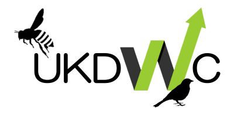

# Modelling the Abundance of UK Butterflies

## Project Context
As part of a new government-led green initiative to prevent biodiversity loss, local councils are to receive a ‘nature grant’ that will be allocated for habitat restoration and species protection. This comes after a report in the State of Nature revealed the number endangered species in Great Britain had risen to 16% [1]. Many experts believe this is likely the result of environmental pressures such as, climate change, air pollution, agricultural pollution and invasive species [1].
## The Goal
It is well known that butterflies are excellent indicators of terrestrial biodiversity, due to the diverse range of habitats they occupy, and their sensitivity to environmental changes. To help regional councils decide how they should allocate their grant, the UK Data for Wildlife Conservation (UKDWC) has been commissioned to produce a report detailing the abundance trends of butterflies on a national scale. The report will highlight species of butterfly in decline and produce a list of ‘recommended actions’ that regional decision makers can use to focus their budgets accordingly. 
## About the UKWDC

The UKWDC is a non-profit environmental research organisation, that monitors biodiversity and ecosystems in the UK, reporting its findings to various charities and central government. Since its founding in 1963, the company has gained a reputation for its excellent ecological modelling capabilities and data-centric environmental reports. 
